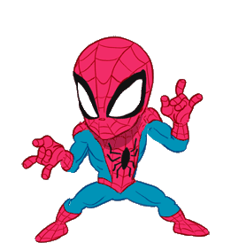

#  Aranhaverso

> Projeto disponibilizado pela [Dio](https://web.dio.me/) para o Bootcamp Ri Happy - Front-end do Zero.

## 👩‍💻 O projeto

🔗 [Visite o Aranhaverso](https://codebytayne.github.io/aranhaverso/)

-------
O objetivo desse desafio foi recriar uma página interativa e divertida sobre o multiverso do Homem-Aranha, usando HTML, CSS e JavaScript a partir de um prototipo disponibilizado no [Figma](https://www.figma.com/design/GjvdE0uob68X6pEHqw2pY8/Multiverse-Spider-Man?node-id=1-17&p=f) pela especialista [Michele Ambrosio](https://www.linkedin.com/in/michele-ambrosio-a4899661/), responsavel pelo desafio em questão desse Bootcamp.

## 💬 Assuntos abordados

- HTML
    - Estruturação da página 
    - Semântica
    - Acessibilidade
    - Web Scraping
    - SEO
- CSS
    - Posicionamentos
    - Pseudo-elementos
    - Pseudo-classes
    - Flexbox
    - Animações 
- JavaScript
    - Introdução ao JavaScript
    - Manipulação do DOM
    - Introdução ao Firebase
    - Integração com o Firebase

## 📂 Estrutura do Projeto

aranhaverso                                   
├─ assets                                     
│  ├─ css                                     
│  │  ├─ components                           
│  │  │  ├─ _gallery.css                      
│  │  │  ├─ _link-button.css                  
│  │  │  ├─ _navigator.css                    
│  │  │  └─ _pills.css                        
│  │  ├─ global.css                           
│  │  ├─ home-page-styles.css                 
│  │  ├─ internal.css                         
│  │  ├─ README.md                            
│  │  └─ reset.css                            
│  ├─ images                                  
│  │  ├─ cursor                               
│  │  │  ├─ cursor.png                        
│  │  │  └─ cursorhover.png                   
│  │  ├─ demo                                 
│  │  │  └─ demo.gif                          
│  │  ├─ favicon                              
│  │  │  └─ favicon.png                       
│  │  ├─ icons                                
│  │  │  ├─ spider.svg                        
│  │  │  ├─ spiderman1-andrew.png             
│  │  │  ├─ spiderman1-tom.png                
│  │  │  └─ spiderman1.png                    
│  │  ├─ spiderman-andrew                     
│  │  │  ├─ movie-01                          
│  │  │  │  ├─ gallery                        
│  │  │  │  │  ├─ image-01.png                
│  │  │  │  │  ├─ image-02.png                
│  │  │  │  │  └─ image-03.png                
│  │  │  │  ├─ background.png                 
│  │  │  │  └─ logo.png                       
│  │  │  └─ movie-02                          
│  │  │     ├─ gallery                        
│  │  │     │  ├─ image-01.png                
│  │  │     │  ├─ image-02.png                
│  │  │     │  └─ image-03.png                
│  │  │     ├─ AndrewGarfield_02.webp         
│  │  │     ├─ background.jpg                 
│  │  │     ├─ background.png                 
│  │  │     └─ logo.png                       
│  │  ├─ spiderman-tobey                      
│  │  │  ├─ movie-01                          
│  │  │  │  ├─ gallery                        
│  │  │  │  │  ├─ image-01-full.jpg           
│  │  │  │  │  ├─ image-01.png                
│  │  │  │  │  ├─ image-02-full.jpg           
│  │  │  │  │  ├─ image-02.png                
│  │  │  │  │  ├─ image-03-full.jpg           
│  │  │  │  │  └─ image-03.png                
│  │  │  │  ├─ background.png                 
│  │  │  │  └─ logo.png                       
│  │  │  ├─ movie-02                          
│  │  │  │  ├─ gallery                        
│  │  │  │  │  ├─ image-01.png                
│  │  │  │  │  ├─ image-02.png                
│  │  │  │  │  └─ image-03.png                
│  │  │  │  ├─ background.png                 
│  │  │  │  └─ logo.png                       
│  │  │  └─ movie-03                          
│  │  │     ├─ gallery                        
│  │  │     │  ├─ image-01.png                
│  │  │     │  ├─ image-02.png                
│  │  │     │  └─ image-03.png                
│  │  │     ├─ background.png                 
│  │  │     └─ logo.png                       
│  │  ├─ spiderman-tom                        
│  │  │  ├─ movie-01                          
│  │  │  │  ├─ gallery                        
│  │  │  │  │  ├─ image-01.png                
│  │  │  │  │  ├─ image-02.png                
│  │  │  │  │  ├─ image-03.png                
│  │  │  │  │  └─ image-04.png                
│  │  │  │  ├─ background.png                 
│  │  │  │  └─ logo.png                       
│  │  │  ├─ movie-02                          
│  │  │  │  ├─ background.png                 
│  │  │  │  └─ logo.png                       
│  │  │  └─ movie-03                          
│  │  │     ├─ background.png                 
│  │  │     └─ logo.png                       
│  │  ├─ homemaranha.gif                      
│  │  ├─ pic-sm-bg-01-before-edition.jpg      
│  │  ├─ pic-sm-bg-01.jpg                     
│  │  ├─ pic-sm-bg-01.png                     
│  │  ├─ pic-sm-bg-02.jpg                     
│  │  ├─ pic-sm-bg-03.jpg                     
│  │  ├─ spider-man-01.png                    
│  │  ├─ spider-man-02.png                    
│  │  ├─ spider-man-03.png                    
│  │  └─ spider-man-background.jpg            
│  ├─ scripts                                 
│  │  ├─ index.js                             
│  │  ├─ README.md                            
│  │  └─ script.js                            
│  └─ videos                                  
│     ├─ amazing-spiderman-2014-trailer.mp4   
│     ├─ amazing-spiderman2-2014-trailer.mp4  
│     ├─ spiderman-2002-trailer-teste.mp4     
│     ├─ spiderman-2002-trailer.mp4           
│     ├─ spiderman-2017-trailer.mp4           
│     ├─ spiderman2-2004-trailer.mp4          
│     ├─ spiderman2-2019-trailer.mp4          
│     ├─ spiderman3-2007-trailer.mp4          
│     └─ spiderman3-2021-trailer.mp4          
├─ pages                                      
│  ├─ andrew-garfield                         
│  │  ├─ README.md                            
│  │  ├─ spiderman1.html                      
│  │  └─ spiderman2.html                      
│  ├─ tobey-maguire                           
│  │  ├─ README.md                            
│  │  ├─ spiderman1.html                      
│  │  ├─ spiderman2.html                      
│  │  └─ spiderman3.html                      
│  ├─ tom-holland                             
│  │  ├─ README.md                            
│  │  ├─ spiderman1.html                      
│  │  ├─ spiderman2.html                      
│  │  └─ spiderman3.html                      
│  └─ README.md                               
├─ index.html                                 
└─ README.md                                  

